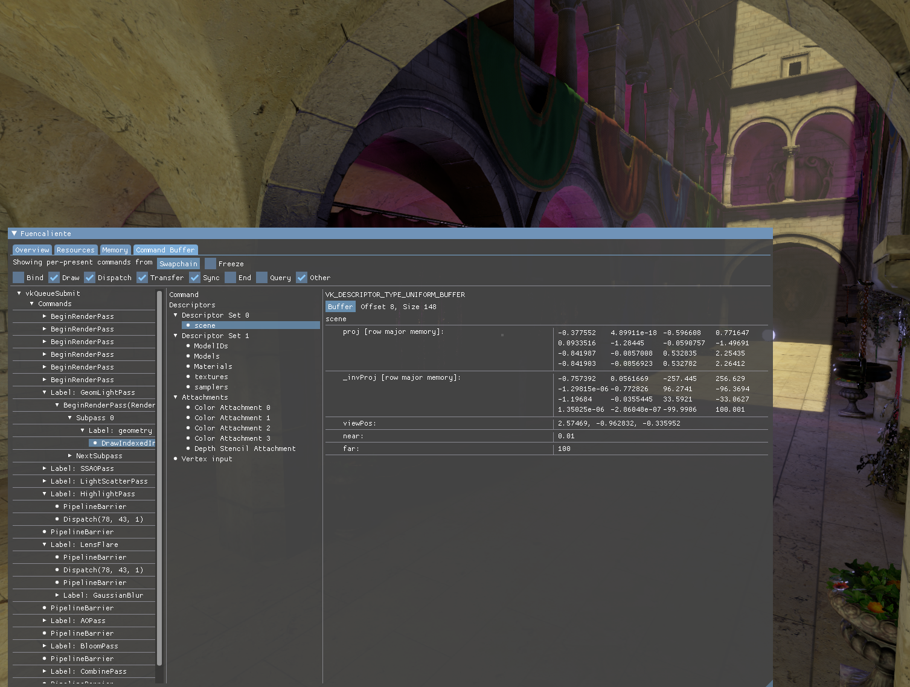
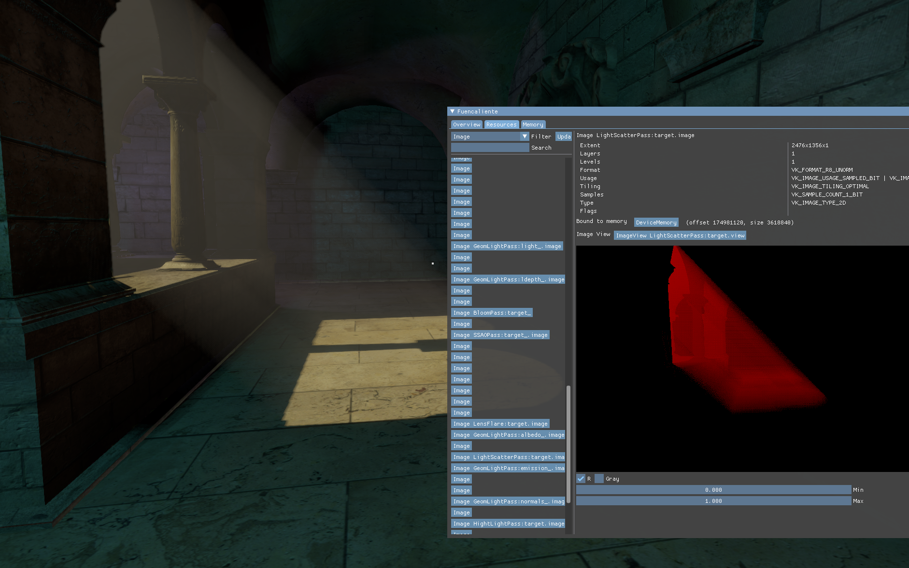

# VIL: Vulkan Introspection Layer

Vulkan layer that allows to inspect GPU state and submitted commands live
inside your applications.


Features:

- show all created resources, their information and state
	- can be identified via debug names
	- visualize content of images and see buffer content
- inspect recorded and executing command buffers with live GPU timings
	- quickly inspect pipeline state
	- inspect all submissions, queues and synchronization primitives
	- view the effective properties of draw & dispatch calls, also for indirect commands
	- show all state bound for a draw/dispatch command and all outputs, live
		- display images
		- show and interpret buffer content
		- show vertex input (vertex output, model visualization and 
		  other pre-rasterization stages are WIP)
		- show the contents of framebuffer attachments after a draw call
	- debug shaders, seeing the variables update live (WIP)
- show general debug information about the application such as
	- enabled device and instance extensions
	- enabled features
	- overall statistics on used memory and available memory budget

This is still in an early stage of development, bug reports and feedback welcome.
See the [rough overview](docs/features.md) over the currently implemented vulkan 
commands/extensions. Keep in mind that using extensions/features not supported
by the layer at the moment might cause crashes.

Intended much more as a live debugging tool than a profiling tool.
Does not have all the features of existing debugging tools (such as [renderdoc](https://github.com/baldurk/renderdoc))
at the moment, but can already be useful to debug problems that are
hard to find in traditional debugging tools.
Unlike capture-based tools, this allows a **live** introspection.
This can be useful to debug temporal or synchronization issues (doing this
with per-frame captures can be bothersome) or as first-try
debugging approach to figure out roughly where a problem is, without
having to wait for a capture to load. It also is useful as a general-purpose
introspection tool, capture-based tools are usually optimized to only show
resources important for their capture, leaving out the rest.

Downsides:

- Writing captures/gpu state to disk and viewing it later on is not possible
  and is likely just out of the scope of this project. There are great
  tools for that.
- This isn't as stable/feature-complete as known tools
- Shader debugging is in a very experimental stage, more of a prototype
- The live nature of the introspection makes inspected state more volatile.
  While it is possible to freeze some state and also view e.g.
  invalidated/destroyed command records, you might run into issues
  where state you would want to inspect (from a specific frame) is just
  not available anymore.

<!---  -->
<!----  -->

# Building & Installing

Supported/Tested platforms:

- Unix, gcc & clang (with solid C++17 support)
	- xcb, xlib and wayland platforms
  - hooked overlay not supported on wayland, it is too well designed to allow hacks like that.
    Just integrate vil with your application using the API or set the `VIL_CREATE_WINDOW=1` environment var
	for a separate window (that works on native wayland). Or make your application use xcb/xlib.
	- only actively tested on linux, bug reports and improvements for
	  other platforms appreciated
- Windows with MSVC 2019/2022 (x64)
  You can find prebuilt libraries in the release section. To install the layer,
  just run the `register_layer.bat` after unpacking the zip.

Windows+MinGW will hopefully eventually be supported/tested. Please report
issues, if you try this.

**NOTE**: 32-bit platforms are currently not supported. Pull requests are welcome but you'd likely have to maintain it yourself/set up CI.

To build the layer from scratch, you'll need an up-to-date version of [meson](https://github.com/mesonbuild/meson/releases).

## Building on Unix

Just clone the repository and run:

```shell
meson build
ninja -C build
```

To install the layer you can just run `ninja -C build install` (you might need superuser rights for that).
By default, meson will install to `/usr/local` so - depending on your system - the layer configuration file or
layer library itself might not be found by the vulkan loader. Either make sure that `/usr/local` is properly
included in your system's library and vulkan loader search paths or change the install prefix to `/usr` 
via meson (e.g. run `meson --prefix=/usr build` in the beginning).
Be warned that using the `/usr` prefix for manually built libs/applications is generally not recommended since it might mess
with your package manager.

## Building on Windows

On windows, this is actively tested with MSVC 2019, older version will likely not work due to incomplete/incorrect C++17 support.
Since we require c11, MSVC >= 19.28 is required (visual studio 16.8).
The recommended/tested way to build it:

1. Run `meson build --backend vs2019` (or `vs2022`) from command line in the vil folder.
2. If everything goes correctly, you will have a Visual Studio solution (in a `build` folder) that you can build.

Alternatively, you can also use ninja to build it on windows.

You will still need to install the layer after building it, so that other applications
can find it. Just run the `register_layer.bat` in the build folder (running it once
is enough, it just adds the path to the registry).
For more information, manual installation (or if you are vary of running random
bat files from the internet), see [here](docs/install.md)

# Using vil

Once installed, you have to make sure vulkan applications load `VK_LAYER_live_introspection`.
Either pass it to your `VkInstanceCreateInfo` or enable it via environment variable `VK_INSTANCE_LAYERS=VK_LAYER_live_introspection`.
During the early stages of this project, you likely want to load it *before* any validation layer. If
your application then triggers validation errors with *vil* that are not there without it,
make sure to report them here!

There are multiple ways of using the introspection gui:

- Make the layer create a new window containing the debug gui when the application starts.
  This is enabled by default.
  You can control it via the environment variable `VIL_CREATE_WINDOW={0, 1}`.
- Make the layer draw an overlay over your application
	- Since the layer gui still needs input you have to supply it via
	  a separate api. See [include/vil_api.h](include/vil_api.h).
	  As soon as you call the API to create an overlay on a swapchain,
	  the extra debug window will be closed (if there was one).
	- Experimental: Make the layer hook the application's input
	  so the overlay can work as a simple drop-in, without having to change
	  the application for it. This is highly platform-specific and might
	  not work with certain platforms/applications.
	  This is not enabled by default (and might be disabled from the default
	  build config or even completely removed from the layer in future).
	  You can force it via the environment variable `VIL_HOOK_OVERLAY=1`.

## About retail games

Using this layer in retail application/games (i.e. applications you don't develop yourself,
without available source code or debugging symbols) **IS NOT OFFICIALLY SUPPORTED**.
There are multiple reasons for this:

- It can be expected that the layer will cause issues in quite some games,
  especially in this early stage of development. Bug reports of the
  form "Game XY crashes when enabling this layer" are not too useful since
  it would require installing Game XY and then trying to reverse-engineer
  what it does to cause a crash in the layer. Sometimes, the result would
  be that the game/application simply does not follow the vulkan spec
  and while the driver can handle it, the layer cannot.
- Using this layer in games might trigger anti-cheat mechanisms.
  Using this layer in multiplayer games might get you banned.
  Even just playing games that include a multiplayer mode locally with the 
  layer might get you in trouble. Just don't do it.
- Usage of this layer in retail products might be motivated by abuse.
  Keep in mind that while game developers usually have no problem with
  players sharing videos or screenshots of the gameplay; extracting
  textures, models, raw framebuffer data or rendering techniques from the game
  (and then distributing them) might not be in the interest of the developer
  or fair use of the material. This is not the usecase this layer 
  is intended for and not a usecase that will be supported in any way.

With that out of the way, there is nothing per se wrong with using the
layer in retail products and games you have not written yourself. As long as you
don't expect us to make it to work or distribute the results.
When you can point out what *exactly* is causing the layer to crash with a
specific game or fix a problem inside the layer to allow using it with
a retail product, we definitely want to hear of it. But additional code paths
inside the layer that work around specific *game issues* will not
be accepted.

# License

SPDX-License-Identifier: GPL-3.0-only

Unless stated otherwise, code and assets in this repository are licensed under 
GPLv3. Contributors [don't have to sign a CLA](https://drewdevault.com/2018/10/05/Dont-sign-a-CLA.html).

Note that since this is a dynamically loaded vulkan layer and not a library 
you link your application against, using this in production of proprietary 
products should not be a problem and is inside the intended usecase.
