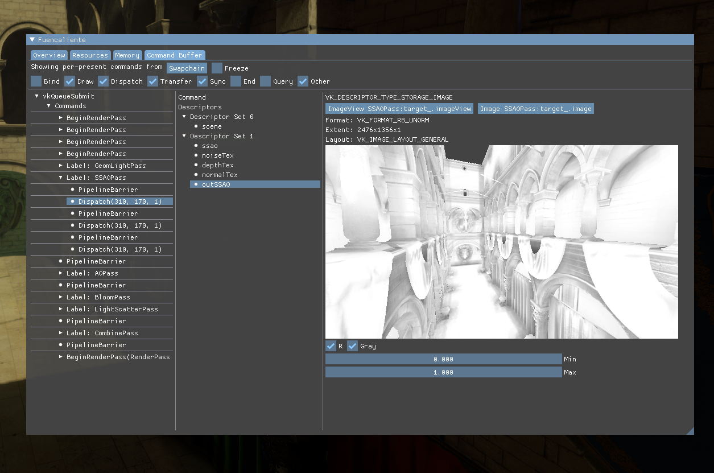
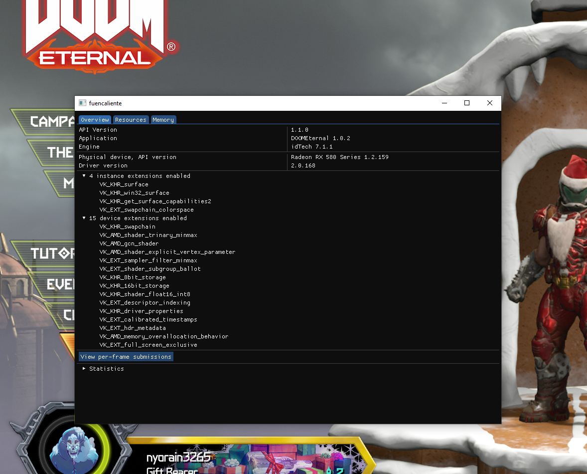

# Fuencaliente

Vulkan in-app debugging layer that is able to provide
live introspection via a debug window/overlay.

This is still in a very early stage of development. Bug reports are welcome.
There are various known issues and some of the features below are work-in-progess.
See the [rough overview](docs/features.md) over the currently implemented vulkan 
commands/extensions. Keep in mind that using extensions/features not supported
by the layer at the moment might cause crashes.



Features:

- showing all created resources, their usage, content and connection
	- can be identified via debug names
	- visualize content of images and see buffer content
- inspect recorded and executing command buffers with live GPU timings
	- quickly inspect pipeline state
	- inspect all submissions done to the device and their connection
	- view the effective properties of draw & dispatch calls, also for indirect commands
	- show all state bound for a draw/dispatch command and all outputs, live
		- display images
		- show and interpret buffer content
		- show vertex input (vertex output, model visualization and 
		  other pre-rasterization stages are WIP)
		- show the contents of framebuffer attachments after a draw call
- showing general debug information about the application such as
	- enabled device and instance extensions
	- enabled features
	- overall statistics on used memory and available memory budget

Intended much more as a live debugging tool than a profiling tool.
Does not have all the features of existing debugging tools (such as [renderdoc](https://github.com/baldurk/renderdoc))
at the moment, but can already be useful to debug problems that are
hard to find in traditional debugging tools.
Unlike capture-based tools, this allows a **live** introspection.
This can be useful to debug temporal or synchronization issues (doing this
with per-frame captures can be bothersome) or as first-try
debugging approach to figure out roughly where a problem is, without
having to wait for a capture to load. It also is useful as a general-purpose
introspection tool, capture-based tools are usually optimized to only show
resources important for their capture, leaving out the rest.
It also allows to easily debug compute-only vulkan applications that
don't have a swapchain (renderdoc can do that but requires the application
to explicitly call renderdoc api).

Downsides:

- Writing captures/gpu state to disk and viewing it later on is not possible
  and is likely just out of the scope of this project. There are great
  tools for that.
- This isn't as stable/feature-complete as known tools
- Currently, there is no shader debugging at all. Might be added in the
  far away future.
- The live nature of the introspection brings various problems with it.
  While it is already possible to freeze some state and also view e.g.
  invalidated/destroyed command records, you might run into issues
  where state you would want to inspect (from a specific frame) is just
  not available anymore. Keep in mind that sometimes, capturing a single
  frame and viewing that is just the better approach.


# Building & Installing

Supported/Tested platforms:

- Unix, gcc & clang (with solid C++17 support)
	- xcb, xlib and wayland platforms.
	- only actively tested on linux, bug reports and improvements for
	  other platforms appreciated
- MSVC 2019 (x64)
- MinGW (this one is not tested at the moment and might give you problems
  but reported issues will be fixed. CI for this platform is WIP).

Currently (as there isn't even an official release), there are no prepackaged
binaries or build scripts, you have to build and install it yourself. Clone the
repository and run:

```shell
meson build
ninja -C build
```

You'll need an up-to-date version of [meson](https://github.com/mesonbuild/meson/releases).
On **unix** you can just run `ninja install` (you might need superuser rights
and also might adjust the install prefix to /usr/lib, depending on your system)
to install the library and layer config.

On **windows**, layers are installed via registry entries, you have to add
a registry entry in `HKEY_LOCAL_MACHINE\SOFTWARE\Khronos\Vulkan\ExplicitLayers` pointing to the generated layer config 
json (that must be located in the same folder as `VkLayer_fuencaliente.dll`).
You can simply run the `register_layer.bat` script in the build directory. Note that it will require admin privileges
to add the registry key. You should usually not run random batch scripts from the internet that require admin privileges,
so feel free to do it manually in an admin prompt:

```
REG ADD HKEY_LOCAL_MACHINE\SOFTWARE\Khronos\Vulkan\ExplicitLayers /v <filepath of VKLayer_fuencaliente.json> /t REG_DWORD /d 0
```

Where you replace `<filepath of VKLayer_fuencaliente.json>` with full file path of the generated `VKLayer_fuencaliente.json` file, e.g. `D:\code\vlid\build\vs19\VKLayer_fuencaliente.json`.

Once installed, you have to make sure vulkan applications load `VK_LAYER_vlid`.
Either pass it to your `VkInstanceCreateInfo` or enable it via environment variable `VK_INSTANCE_LAYERS=VK_LAYER_vlid`.
During the early stages of this project, you likely want to load it *before* any validation layer. If
your application then causes triggers validation errors with `vlid` that are not there without it,
make sure to report them here!

# Using it

There are multiple ways of using this layer:

- Make the layer create a new window holding the debug gui when the application starts.
  This is the current default, you can control it via the environment variable
  'FUEN_CREATE_WINDOW={0, 1}'.
- Make the layer draw an overlay over you application
	- Since the layer gui still needs input you have to supply it via
	  a non-vulkan api. See [include/fuen_api.h](include/fuen_api.h).
	  As soon as you call the API to create an overlay on a swapchain,
	  the extra debug window will be closed (if there was one).
	- Experimental: Make the layer hook the application's input
	  so the overlay can work as a simple drop-in, without having to change
	  the application for it. This is highly platform-specific and might
	  not work with certain platforms/applications.
	  This is not enabled by default (and might be disabled from the default
	  build config or even completely removed from the layer in future).
	  You can force it via the environment variable 'FUEN_HOOK_OVERLAY=1'.

The layer running gui inside an extra window in doom eternal:



## About retail games

Using this layer in retail application/games (i.e. games you don't develop yourself,
without available source code or debugging symbols) **IS NOT SUPPORTED**.
There are multiple reasons for this:

- It can be expected that the layer will cause issues in quite some games,
  especially in this early stage of development. Bug reports of the
  form "Game XY crashes when enabling this layer" are not too useful since
  it would require installing Game XY and then trying to reverse-engineer
  what it does to cause a crash in the layer. Sometimes, the result would
  be that the game/application simply does not follow the vulkan spec
  and while the driver can handle it, the layer cannot.
  Even for open-source games such bug reports are not useful.
- Using this layer in games will likely trigger anti-cheat mechanisms.
  **USING THIS LAYER IN MULTIPLAYER GAMES MIGHT GET YOU BANNED AND THAT
  IS NOT OUR FAULT**. As this layer messes with draw calls it is basically a
  wallhack (you can literally view the final image without certain draw
  calls being made) and so games are entirely right in banning
  players for using it. Even just playing games that include
  a multiplayer mode locally with the layer might get you in trouble.
  Just don't do it. And don't blame us if it backfires.
- Usage of this layer in retail products might be motivated by abuse.
  Keep in mind that while game developers usually have no problem with
  players sharing videos or screenshots of the gameplay, extracing
  textures, models, raw framebuffer data or rendering techniques from the game
  (and then distributing them) is likely not in the interest of the developer,
  and can quickly bring legal trouble. This is not the usecase this layer 
  is intended for and not a usecase that will be supported in any way.

With that out of the way, there is nothing per se wrong with using the
layer in retail products and games you have not written yourself. As long as you
don't expect us to make it to work or distribute the results.
When you can point out what *exactly* is causing the layer to crash with a
specific game or fix a problem inside the layer to allow using it with
a retail product, we definitely want to hear of it. But additional code paths
inside the layer that work around specific *game issues* will not
be accepted.

Using the layer via an overlay inside the demo level of [vkQuake2](https://github.com/kondrak/vkQuake2):


# License

Unless stated otherwise, code and assets in this repository are licensed under 
GPLv3. Contributors [don't have to sign a CLA](https://drewdevault.com/2018/10/05/Dont-sign-a-CLA.html), 
you own what you contribute back.

Note that since this is a dynamically loaded vulkan layer and not a library 
you link your application against, using this in production of proprietary 
products should not be a problem and is inside the intended usecase.
